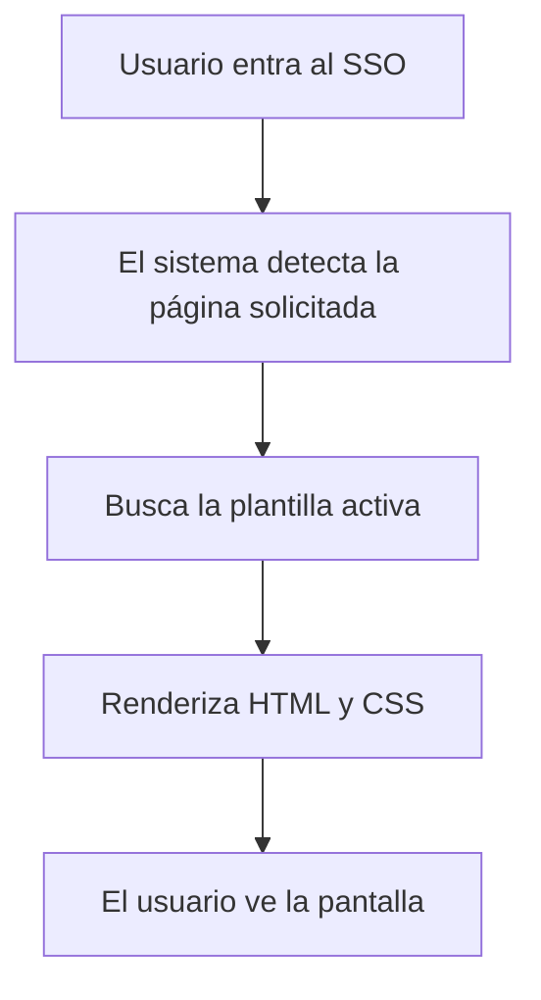

# Documentación de Templates para el SSO

## 1. Objetivo

Este documento describe el modelo de templates para el SSO de Auth0rize.

El objetivo es permitir que cada página del SSO tenga un diseño base y, además, permitir crear variantes personalizadas sin perder el diseño original.

---

## 2. Problema que resuelve

En un SSO existen varias páginas, por ejemplo:

- login
- registro
- recuperación de contraseña
- confirmación de cuenta

Cada una puede tener un diseño distinto y cada dominio puede requerir una personalización visual.

Por eso el modelo separa dos conceptos:

1. la página del SSO;
2. la plantilla visual que define cómo se verá esa página.

---

## 3. Conceptos clave

### 3.1 SsoPage
Representa una página real del flujo de autenticación.

Ejemplos:
- login
- register
- forgot-password
- confirm-account

### 3.2 SsoTemplate
Representa una versión visual de esa página.

Contiene:
- HTML del diseño
- CSS del diseño
- si es la plantilla base
- si está activa
- si deriva de otra plantilla

---

## 4. Flujo de funcionamiento

---

## 5. Ejemplo práctico

Supongamos que el dominio de una empresa tiene una página de login.

1. Se crea una plantilla base llamada Login Base.
2. Se crea una plantilla personalizada llamada Login Corporativo.
3. Se activa la plantilla personalizada.
4. Si algo falla, se vuelve a activar la plantilla base.

---

## 6. Beneficios

- Se conserva el diseño original.
- Se pueden crear variantes sin reemplazar la base.
- Es fácil regresar al diseño estándar.
- Permite personalización por dominio.

---

## 7. Resumen

El modelo funciona como un sistema de diseño controlado para el SSO:

- una página tiene una o varias plantillas;
- una plantilla puede ser base o personalizada;
- solo una plantilla puede estar activa por página;
- el diseño original siempre se conserva.
